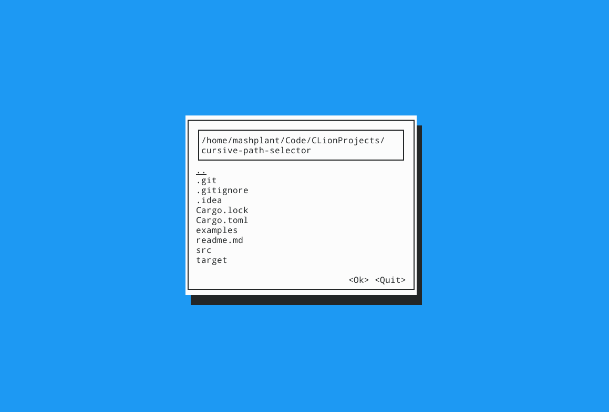

A cursive view that can display directories and allow user to select a path in the file system.

Example (see [examples/main.rs](examples/main.rs)):

Features:

1. use direction key up and down to select path
2. double click a path to enter it (if it is not a valid sub directory, an error will be displayed)